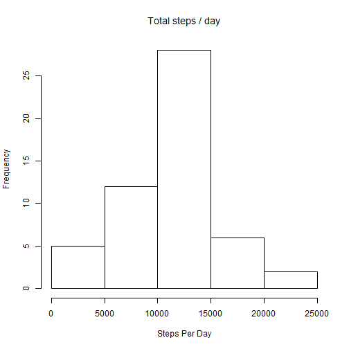

### Section 1 - What is mean total number of steps taken per day?

This is to represent the total number of steps taken per day in the form of histogram. 

The R code to identify the total steps taken per day is as given below.


```r
library(knitr)
library(dplyr)
data <- read.csv("activity.csv")
DataDf <- tbl_df(data)
by_day <- group_by(DataDf, date)
StepPerDay <- summarise(by_day, TotalSteps = sum(steps))
```

The histogram represenatation of the step taken per day is:


```r
hist(StepPerDay$TotalSteps, names.arg=StepPerDay$Date, 
        main=expression('Total steps / day'),
        xlab='Steps Per Day')
```

 

The mean and median number of steps per day can be obtained using the mean function


```r
MeanSteps <- mean(StepPerDay$TotalSteps, na.rm = TRUE)
MedianSteps <- median(StepPerDay$TotalSteps, na.rm = TRUE)
MeanSteps
```

```
## [1] 10766.19
```

```r
MedianSteps
```

```
## [1] 10765
```

### Section 2 - What is the average daily activity pattern?

This section is to identify the pattern of the number of steps taken during differnt intervals and make a time series plot of the same.  To achieve this, we will determine the average number of steps taken in every interval accross all days.


```r
by_interval <- group_by(DataDf, interval)
StepsByInterval <- summarise(by_interval, AvgPerInterval = mean(steps, na.rm = TRUE))
plot(StepsByInterval$interval, StepsByInterval$AvgPerInterval, 
     type = "l", xlab = "5-min Interval", 
     ylab = "Average Num of Steps", 
     main = "Average Daily Activity Pattern")
```

 

Interval when Maximum number of steps are taken is


```r
MaxStepsinterval <- filter(StepsByInterval, AvgPerInterval == max(AvgPerInterval))
MaxStepsinterval$interval
```

```
## [1] 835
```

### Section 3 - Imputing missing values

Identifying number of rows where the steps count is not recorded i.e is present as NA in the dataset


```r
nrow(filter(DataDf, is.na(steps)))
```

```
## [1] 2304
```
#### Strategy for filling in all of the missing values in the dataset

The stratergy to replace the missing values is to replace NA with the average steps value for that interval

#### Creating new dataset with missing values replaced

These following logic is used to create the new data set
1. Join the(using merge function) source data with the dateset generated above having the average steps by interval
2. Identify records with NA and replace with the average using mutate function as part of dplyr library

The Code to achieve this is as given


```r
mrgdata <- tbl_df(merge(DataDf,StepsByInterval, by = "interval" ))
mgrdata_narepl <- mutate(mrgdata, steps_nareplaced = ifelse(is.na(steps), AvgPerInterval, steps))
NewDataDf <- arrange(select(mgrdata_narepl, steps_nareplaced, date, interval),date)

NewDataDf
```

```
## Source: local data frame [17,568 x 3]
## 
##    steps_nareplaced       date interval
## 1         1.7169811 2012-10-01        0
## 2         0.3396226 2012-10-01        5
## 3         0.1320755 2012-10-01       10
## 4         0.1509434 2012-10-01       15
## 5         0.0754717 2012-10-01       20
## 6         2.0943396 2012-10-01       25
## 7         0.5283019 2012-10-01       30
## 8         0.8679245 2012-10-01       35
## 9         0.0000000 2012-10-01       40
## 10        1.4716981 2012-10-01       45
## ..              ...        ...      ...
```

#### Creating the histogram re-using the same code created earlier


```r
New_by_day <- group_by(NewDataDf, date)
NewStepPerDay <- summarise(New_by_day, TotalSteps = sum(steps_nareplaced))

hist(NewStepPerDay$TotalSteps, names.arg=StepPerDay$Date, 
        main=expression('Total steps / day'),
        xlab='Steps Per Day')
```

 
The mean and median number of steps per day can be obtained using the mean function


```r
NewMeanSteps <- mean(NewStepPerDay$TotalSteps, na.rm = TRUE)
NewMedianSteps <- median(NewStepPerDay$TotalSteps, na.rm = TRUE)
NewMeanSteps
```

```
## [1] 10766.19
```

```r
NewMedianSteps
```

```
## [1] 10766.19
```

```r
MeanDiff <- NewMeanSteps - MeanSteps
MedianDiff <- NewMedianSteps - MedianSteps

print(sprintf("Difference in Mean steps count after replacing NA with average is: %f ", MeanDiff))
```

```
## [1] "Difference in Mean steps count after replacing NA with average is: 0.000000 "
```

```r
print(sprintf("Difference in Median steps count after replacing NA with average is: %f", MedianDiff))
```

```
## [1] "Difference in Median steps count after replacing NA with average is: 1.188679"
```

Due to adding the missing values, the means remains the same whereas the median increases slightly.

### Section 4 - Are there differences in activity patterns between weekdays and weekends?

The R code to identify the weekend and weekdays patteren is as given


```r
DataWeekdays <- mutate(NewDataDf, WeekDay = weekdays(as.Date(date)))
DataDateType <- mutate(DataWeekdays, DayType = ifelse((WeekDay == "Sunday")|(WeekDay == "Saturday"),"Weekend", "Weekday"))
```

Plotting a time series graph to plot the average number of steps taken, averaged across all weekday days and weekend days

```r
by_interval_Daytype <- group_by(DataDateType, DayType, interval)
StepsByInterval_Daytype <- summarise(by_interval_Daytype, totalsteps_Daytype = mean(steps_nareplaced))

library(ggplot2)
qplot(x = interval, y = totalsteps_Daytype, data = StepsByInterval_Daytype, geom = c("line"), facets = DayType~., ylab = "Average number of Steps")
```

 
